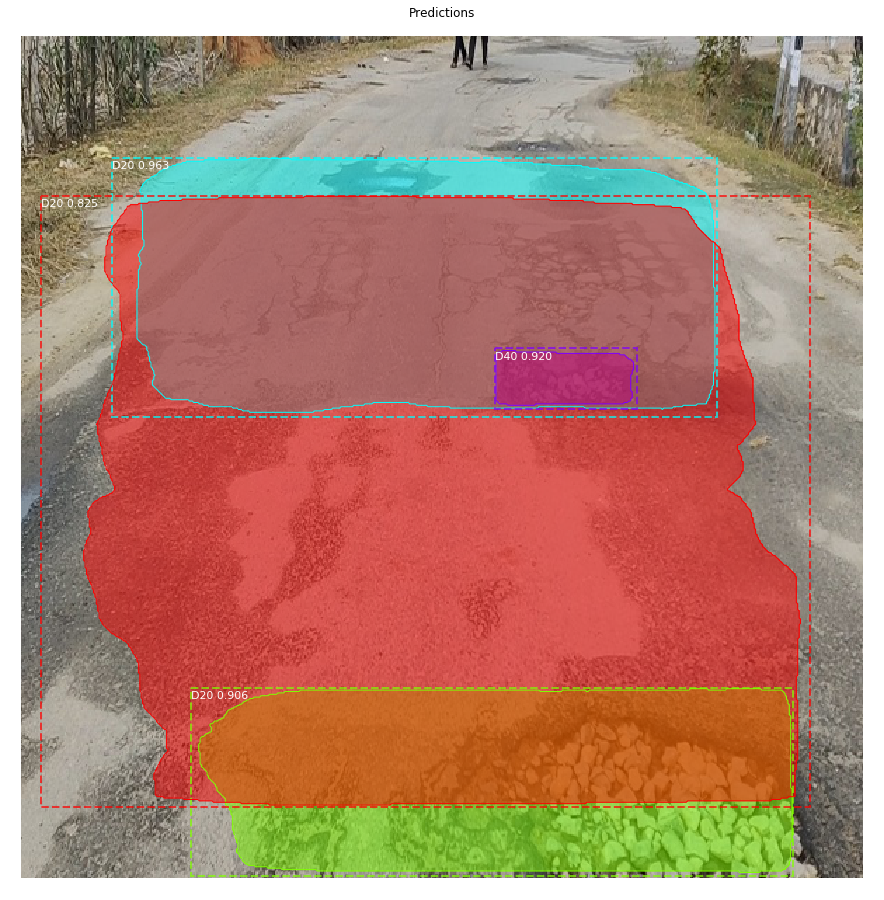
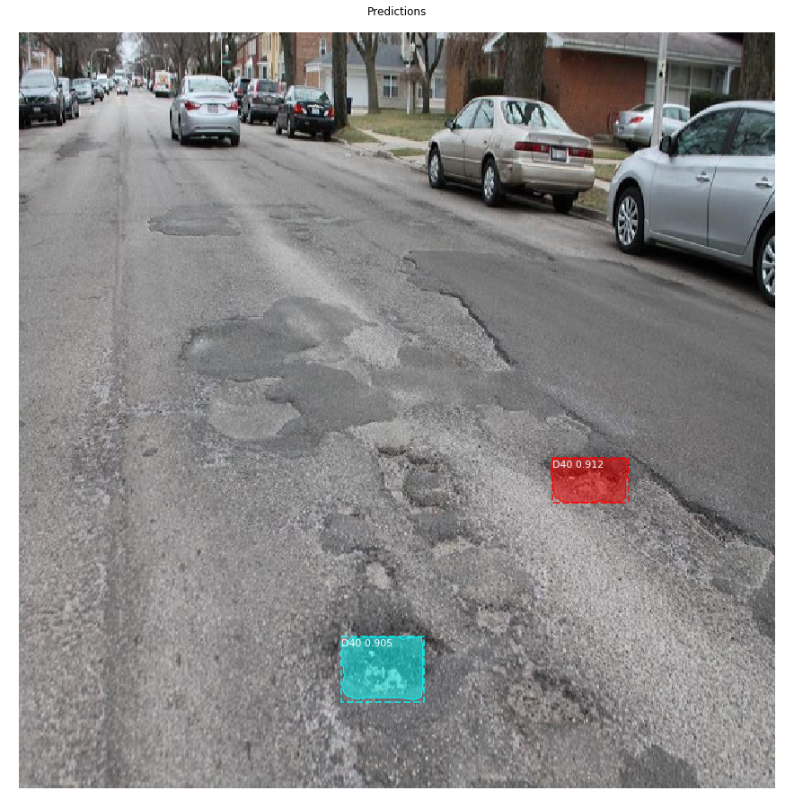

# PCI-Detector
## Result of MaskRCNN

## Download Road Damage Dataset
Please pay attention to the disk capacity when downloading.
- [Dataset(2.4GB)](https://mycityreport.s3-ap-northeast-1.amazonaws.com/02_RoadDamageDataset/public_data/Japan/RDD2020_data.tar.gz)

## Download MaskRCNN and OtherModels

- [MaskRCNN](https://github.com/matterport/Mask_RCNN)
Install it along with tensorflow 1.13 and Keras 2.2.0
- [SSD Inception MobileNet](mobilenet2.0.pb). Reducing Disparity in Images Count. Still Not Enough but can be test for on device app development

## TODO
1. App Development
2. Retraining with More Potholes
3. Improving Inference Capabilities by more fine-tuning parameters
